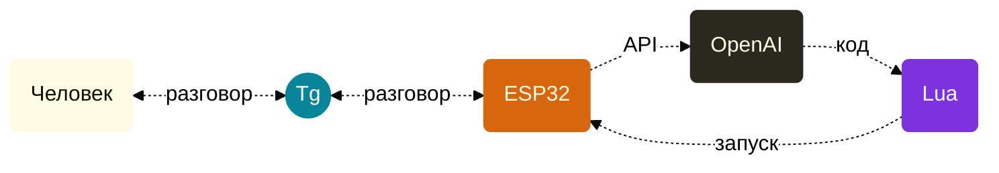

Youtube-запись от `2026-09-18`: https://youtu.be/Pduu6CM6mXs
# ~~Поймали и~~ препарируем агента

## Что вдруг? А вот:


### Кто на ком стоял и зачем?



1. **Человек** через **бота** (это интерфейс такой) отправляет запросы в ESP32
2. **ESP32** перенаправляет запросы **модели** и просит отдать **Lua**-код
3. **Модель** отдаёт **Lua**-код
4. **ESP32** выполняет *(да ладно?!)* этот **Lua**-код и отчитывается **человеку** через **бота**

### Всё понятно, но что конкретно?
 - https://esp-claw.com/
- Вы можете это поставить, но понятней не станет
- А так — станет: https://github.com/espressif/esp-claw
- Ой, оно на **C** написано!
- А ещё там есть предки: [OpenClaw](https://github.com/openclaw/openclaw) и [MimiClaw](https://github.com/memovai/mimiclaw)

> [!WARNING]
> Правильное слово — Assistant.\
> Но не модное. Не то что агент.

### Монстр не может быть простынёй


------------------------------

### Паттерны проектирования агентных и многоагентных систем
> [!TIP]
> [olgpv.me/to/apat](https://olgpv.me/to/apat)

[](https://olgpv.me/to/apat)

- **Безжалостная книга**, никаких приседаний
- «Возьмём интеграл по контуру»
- Нет перевода — нет ошибок перевода
> *«Вызов LLM в примере заменён простой эвристикой для наглядности»* :-)
- Лучше читать одновременно с [Agent Design Patterns](https://www.manning.com/books/agent-design-patterns) (Peter Belchak, 2026) — в ней детали уровнем ниже
  
> [!CAUTION]
> Маркетинг маркетингом, а паттерны-то существуют!\
> Точнее, рождаются, если много работать.\
> И антипаттерны, увы, тоже.


##### Toolbox

###### Запускаем inference («считалки») как службы
- Hailo-Ollama `http://127.0.0.1:8000`
	- Создаём конфиг локального запуска:
		```bash
		sudo tee /etc/systemd/system/hailo-ollama.service > /dev/null <<'EOF'
		[Unit]
		Description=Hailo-Ollama inference server
		After=network.target
		
		[Service]
		Type=simple
		User=op
		WorkingDirectory=/home/op
		Environment=HOME=/home/op
		Environment=OLLAMA_HOST=127.0.0.1:8000
		ExecStart=/usr/bin/hailo-ollama
		Restart=on-failure
		RestartSec=5
		
		[Install]
		WantedBy=multi-user.target
		EOF
		```

	 - Включаем автозапуск и стартуем службу:
		```bash
		sudo systemctl daemon-reload
		sudo systemctl enable --now hailo-ollama
		```


	 - Проверяем состояние и доступность моделей:
		```bash
		systemctl status hailo-ollama --no-pager
		curl -sS --max-time 10 http://127.0.0.1:8000/api/tags
		echo
		```


- Llama.cpp `http://127.0.0.1:8080`
	- Создадим службу:
		```bash
		sudo tee /etc/systemd/system/llama-server.service > /dev/null <<'EOF'
		[Unit]
		Description=llama.cpp inference server
		After=network.target
		
		[Service]
		Type=simple
		User=op
		WorkingDirectory=/home/op
		Environment=HOME=/home/op
		ExecStart=/home/op/box/llama.cpp/build/bin/llama-server \
		    -m /home/op/models/Llama-3.2-3B-Instruct-Q4_K_M.gguf \
		    --host 127.0.0.1 \
		    --port 8080 \
		    --alias local-llama \
		    --jinja \
		    -c 4096 \
		    -t 4 \
		    -np 1
		Restart=on-failure
		RestartSec=5
		
		[Install]
		WantedBy=multi-user.target
		EOF
		```


	  - Запуск и автозапуск:
		```bash
		sudo systemctl daemon-reload
		sudo systemctl enable --now llama-server
		```

	- Проверка:
		```bash
		systemctl status llama-server --no-pager
		curl -sS --max-time 10 http://127.0.0.1:8080/health
		echo
		```


###### Проверяем железо и нужные сервисы

- Модель платы: `cat /proc/device-tree/model; echo`
- Размер памяти: `free -h`
- PCIe-устройства: `lspci -nn`
- Команды в PATH: `command -v llama-cli llama-server hailortcli`
- Модели в ~/models: `ll -R`
- Фотокамеры: `rpicam-hello --list-cameras`
- Обмен командами с ускорителем: `hailortcli fw-control identify`
- Адреса интерфейсов: `ip -br address`
- Маршруты: `ip route`
- TCP-серверы: `ss -ltnp`
- Docker:

	```bash
	docker version
	docker compose version
	docker ps -a
	docker image ls
	```

- Hailo-Ollama (версия, модели на диске, модели в памяти):
	```bash
	curl -sS --max-time 10 http://127.0.0.1:8000/api/version
	echo
	curl -sS --max-time 10 http://127.0.0.1:8000/api/tags
	echo
	curl -sS --max-time 10 http://127.0.0.1:8000/api/ps
	echo
	```

- Версия llama.cpp: `llama-cli --version`
- Работоспособность llama.cpp, включая скорость (см. [help отдельной утилиты](https://github.com/ggml-org/llama.cpp/tree/master/tools/completion)):
	```bash
	llama-completion \
	  -m ./Llama-3.2-3B-Instruct-Q4_K_M.gguf \
	  --jinja \
	  --single-turn \
	  -p "Write one short sentence about a cat." \
	  -n 40 \
	  -c 2048 \
	  -t 4 \
	  --perf
	```

- Скорость ответа Hailo-Ollama (для условного сравнения с llama.cpp):
	```bash
	time curl -sS --max-time 120 \
	  http://127.0.0.1:8000/api/generate \
	  -H 'Content-Type: application/json' \
	  -d '{
	    "model": "llama3.2:3b",
	    "prompt": "Write one short sentence about a cat.",
	    "stream": false,
	    "options": {"num_predict": 40}
	  }'
	echo
	```


###### Настраиваем среду и устанавливаем фреймворк

- Место установки виртуального окружения: `~/playground/agents`
- Берём [smolagents](https://huggingface.co/docs/smolagents/index) — фреймворк для сборки программ класса «агент» (циклы и всякое такое полезное, заодно и разберёмся)
- [Инструкции для smolagents](https://huggingface.co/docs/smolagents/installation?virtual-environment=uv&installation=uv) достаточно, всё встанет
- Проверка установки прямо из командной строки:
	```bash
	python -c "import smolagents; print(smolagents.__version__)"
	```

- Потребуется выбрать один из способов подключения к «считалке» — smolagents предлагает [разные](https://huggingface.co/docs/smolagents/guided_tour?Pick+a+LLM=Ollama#building-your-agent).
- Ну и инструменты. А то агент не сможет ничего сделать.

- Запускаем тест связки LiteLLM → Hailo-Ollama:
	```python
	python - <<'PY'
	from time import perf_counter
	from litellm import completion
	
	started = perf_counter()
	
	response = completion(
	    model="ollama_chat/llama3.2:3b",
	    api_base="http://127.0.0.1:8000",
	    messages=[
	        {"role": "user", "content": "Write one short sentence about a cat."}
	    ],
	    max_tokens=40,
	    temperature=0,
	    timeout=120,
	    stream=False,
	)
	
	print("Ответ:", response.choices[0].message.content)
	print("Причина завершения:", response.choices[0].finish_reason)
	print(f"Время запроса: {perf_counter() - started:.2f} с")
	PY
	```


- Запускаем тест связки LiteLLM  → llama-server:
	```python
	python - <<'PY'
	from time import perf_counter
	from litellm import completion
	
	started = perf_counter()
	
	response = completion(
	    model="openai/local-llama",
	    api_base="http://127.0.0.1:8080/v1",
	    api_key="local",
	    messages=[
	        {"role": "user", "content": "Write one short sentence about a cat."}
	    ],
	    max_tokens=40,
	    temperature=0,
	    timeout=120,
	    stream=False,
	)
	
	print("Ответ:", response.choices[0].message.content)
	print("Причина завершения:", response.choices[0].finish_reason)
	print("Токены:", response.usage)
	print(f"Время запроса: {perf_counter() - started:.2f} с")
	PY
	```

- Запускаем фреймворк через CLI:
	```bash
	smolagent \
		"How to start Llama.cpp server on Debian?"  \
		--model-type "OpenAIModel" \
		--model-id "local-llama" \
	    --api-base "http://127.0.0.1:8080/v1" \
	    --api-key "local"
	```


##### Эксперименты

###### Получить бы что-нибудь

- Войдём в интерактивную оболочку Python.

Подключимся к локальной модели:
```python
from smolagents import OpenAIModel

model = OpenAIModel(
    model_id="local-llama",
    api_base="http://127.0.0.1:8080/v1",
    api_key="local",
)
```

Отправляем запрос и заодно замеряем время-токены:
```python
from time import perf_counter

start = perf_counter()

response = model.generate(
    [{"role": "user", "content": "Как запустить сервер Llama.cpp на Debian?"}],
    max_tokens=40,
    temperature=0,
)

elapsed = perf_counter() - start

print(response.content)
print(f"Время: {elapsed:.2f} с")
print("Токены:", response.token_usage)
```

- Запрос "How big is RAM on this computer?" выполнить не сможет.

###### Теперь с агентом

Создадим агента в режиме CodeAgent:
```python
from smolagents import CodeAgent

model.kwargs.update(temperature=0, max_tokens=256)

agent = CodeAgent(
    tools=[],
    model=model,
    max_steps=2,
    verbosity_level=2,
    stream_outputs=True,
	return_full_result = True,
)
```


- `stream_outputs=True` покажет весь процесс


Дадим команду:
```python
result = agent.run(
	"Найди минимальное простое число, большее, чем 25 в квадрате.",
)

print(result.output)
print("Токены:", result.token_usage)
print("Время:", result.timing)
```

Дадим ещё команду:
```python
result = agent.run(
	"Сколько оперативной памяти на этом компьютере?",
)

print(result.output)
print("Токены:", result.token_usage)
print("Время:", result.timing)
```

- Ну что же это он! А потому что импорты не разрешили. Разрешим:

```python
agent.additional_authorized_imports = ["*"]
agent.authorized_imports = ["*"]

agent.python_executor.additional_authorized_imports = ["*"]
agent.python_executor.authorized_imports = ["*"]
```


Какой промпт ушёл в LLM для исполнения этой команды?
```python
print(agent.system_prompt)
```


Ускоримся — возьмём внешнюю модель:
```python
import os
from smolagents import OpenAIModel

model = OpenAIModel(
    model_id="gpt-4.1-mini",
    api_base="https://api.openai.com/v1",
    api_key=os.environ["OPENAI_API_KEY"],
    temperature=0,
    max_tokens=512,
)
```


###### Поиграем в ЧГК

Новая модель и новый агент:
```python
from smolagents import ToolCallingAgent

model = OpenAIModel(
    model_id="o3",
    api_base="https://api.openai.com/v1",
    api_key=os.environ["OPENAI_API_KEY"],
    reasoning_effort="low",
    max_completion_tokens=4096,
)

agent = ToolCallingAgent(
    tools=[],
    model=model,
    max_steps=3,
    verbosity_level=2,
    stream_outputs=True,
    return_full_result=True,
    planning_interval=1,
)

```

[Вопросы](https://db.chgk.info/tour/kopernik_u):
```python
result = agent.run(
	"Створки средневековых трИптихов могли открываться и закрываться. На одном триптихе Босха на задних поверхностях створок был изображён Иисус. Искусствовед пишет, что задумка художника состояла в том, чтобы совершить символическое действие. Для совершения того же символического действия используют ЕЁ. Назовите ЕЁ.",
)

print(result.output)
print("Токены:", result.token_usage)
print("Время:", result.timing)
```

- Поиск в Интернете запрещён, это хорошо.
- Модель вышла до публикации вопроса.

### И что это было?

> Идём и читаем [код класса CodeAgent](https://github.com/huggingface/smolagents/blob/12c1bc820eca50ace6f80a21d90426d41d74f845/src/smolagents/agents.py#L1505)

Или можно прямо тут:
```python
import inspect

print(inspect.getfile(CodeAgent))
print(inspect.getsource(CodeAgent))
print(inspect.getsource(CodeAgent.run))
```

Кажется, перед нами реализация паттерна. Какого? Ну…


- Даже слова pattern нет, ну надо же
- ReAct [придумали в 2022](https://arxiv.org/abs/2210.03629), у него есть авторы


