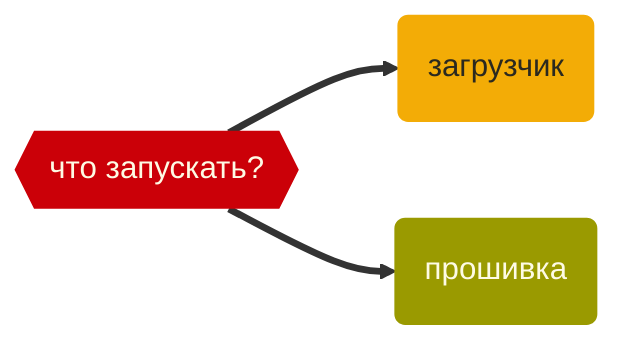

Youtube-запись от `2026-07-17`: https://youtu.be/Ghfi19QcI1c

# CirquitPython для прототипов на плате с nRF

> [!TIP]
> Не все микроконтроллеры одинаково полезны
> Очень часто хочется беспроводных клавиатур и прочих мышек.
> Но чтобы огород не городить. ~~И ещё чтобы AI/ML, а то неприлично.~~


Github проекта: https://github.com/rafgaj/Mouse-buttons-and-wheel

> [!NOTE]
> Хотите BLE + HID?
> Берите [nRF](https://www.nordicsemi.com)!

**Обычно** — через [nRF Connect SDK](https://www.nordicsemi.com/Products/Development-software/nRF-Connect-SDK) и [Zephyr OS](https://www.zephyrproject.org).
Электричество, real time, надёжность, сложность.

**Hardcore** — через Bare metal + набор драйверов [nrfx](https://nrfconnectdocs.nordicsemi.com/ncs/latest/nrfx/index.html) и стандарт [CMSIS](https://www.arm.com/technologies/cmsis).
И будет без [RTOS](https://ru.wikipedia.org/wiki/Операционная_система_реального_времени), зато всё под контролем.

**А прототипы?** А для этого — [CirquitPython](https://learn.adafruit.com/welcome-to-circuitpython/overview).


Всё публично, копайся не хочу: https://github.com/adafruit/circuitpython


## Кому язык, а кому и прошивка
> [!CAUTION]
> Вы забыли, что такое прошивка? И правильно!\
> Это готовая программа для микроконтроллера.\
> Для Windows — `.exe`, а тут — например, `.uf2`



Берём прошивку: систему [CircquitPython](https://learn.adafruit.com/welcome-to-circuitpython/overview), скомпилированную конкретно под плату [Seeed Studio XIAO nRF52840](https://circuitpython.org/board/Seeed_XIAO_nRF52840_Sense/).


> [!WARNING]
> И дальше её куда?!

### Загрузчик написан хитро

1. nRF позволяет реализовать **в коде** протокол USB Mass Storage Class.
2. Что загрузчик и делает. Ну программа так написана.
3. В итоге плата при подключении выглядит как диск.

> [!IMPORTANT]
> Прошить плату == положить файл прошивки на диск

### Прошивка не отстаёт

4. В прошивке сделано то же самое (только диск другой).
5. Ещё и код запускается автоматом.

> [!IMPORTANT]
> Запустить код == обновить `.py`-файл на диске

## Дальше просто делаем — или не просто

`XIAO-SENSE` появляется, если дважды нажать Reset.

Увидеть — `lsblk`:
```bash
NAME        MAJ:MIN RM   SIZE RO TYPE MOUNTPOINTS
loop0         7:0    0     2G  0 loop
sdb           8:16   1  32.1M  0 disk /media/op/XIAO-SENSE
zram0       254:0    0     2G  0 disk [SWAP]
nvme0n1     259:0    0 232.9G  0 disk
├─nvme0n1p1 259:1    0   512M  0 part /boot/firmware
└─nvme0n1p2 259:2    0 232.4G  0 part /
```


И после этого уже заливаем туда `CirquitPython`:
```bash
cp adafruit-circuitpython-Seeed_XIAO_nRF52840_Sense-ru-10.2.1.uf2 /media/op/XIAO-SENSE
```

Плата тут же и перезагрузится — уже в основном режиме и с прошивкой `CirquitPython`.

Проверка — `lsblk`:
```bash
NAME        MAJ:MIN RM   SIZE RO TYPE MOUNTPOINTS
loop0         7:0    0     2G  0 loop
sda           8:0    1     2M  0 disk
└─sda1        8:1    1     2M  0 part /media/op/CIRCUITPY
sdb           8:16   1     0B  0 disk
zram0       254:0    0     2G  0 disk [SWAP]
nvme0n1     259:0    0 232.9G  0 disk
├─nvme0n1p1 259:1    0   512M  0 part /boot/firmware
└─nvme0n1p2 259:2    0 232.4G  0 part /
```


Теперь можно зайти через ==REPL== (Read Eval Print Loop) и позапускать `code.py`:
```bash
minicom -D /dev/ttyACM0
```

Достаточно редактировать `code.py` — и плата тут же будет подхватывать этот код. Там, кстати, уже лежит:
```python
print("Hello World!")
```


Если лежит что-то не то (старое) — чистим flash-память и заново ставим CirquitPython:
```python
import storage
storage.erase_filesystem()
```
(это вводим построчно в REPL)

Мягкий перезапуск, чтобы заметить логи старта — `Ctrl + D`

Перед выключением: `sync`

Ну и кстати мелкое удобство:
```bash
ln -s cp /media/op/CIRQUITPY
```

Напишем какую-нибудь ерунду:
```python
import time

while True:
    print("running")
    time.sleep(1)
```

Ура, стандартные библиотеки импортируются, радость-то какая!

Кстати, [вот они](https://circuitpython.org/board/Seeed_XIAO_nRF52840_Sense/):


Теперь проверим кнопки. Ну что они вообще нажимаются.
```python
import time
import board
import digitalio

pins = [
    ("D7", board.D7),
    ("D8", board.D8),
    ("D9", board.D9),
    ("D10", board.D10),
]

buttons = []

for name, pin in pins:
    button = digitalio.DigitalInOut(pin)
    button.direction = digitalio.Direction.INPUT
    button.pull = digitalio.Pull.UP
    buttons.append((name, button, True))

print("Ready")

while True:
    for i, (name, button, last_value) in enumerate(buttons):
        value = button.value

        if last_value and not value:
            print(name, "pressed")

        buttons[i] = (name, button, value)

    time.sleep(0.02)
```

И осталось передавать это нажатие на компьютер.

Дадим шанс [внешнему коду](https://github.com/rafgaj/Mouse-buttons-and-wheel), попытаемся его поставить.
И заодно в нём разобраться.

Сначала зальём код. От него и нужно-то только ==\*.py== и библиотеки. Ой.

С ==.py== всё просто:
```bash
cp *.py ../cp
```


А вот при запуске сразу ловим ошибку:
```text
Трассировка (последний вызов):
  Файл "code.py", строка 7, в <module>
ImportError: Нет модуля с именем 'Q'
```

Модули-то мы и не поставили. Они же библиотеки. А как без них, Python же.

Для установки библиотек на плату (!) нужен [circup](https://github.com/adafruit/circup) тех же Adafruit:
```bash
sudo apt install pipx
pipx ensurepath
pipx install circup
```

(ну или через `pip3`, если у вас система позволяет)

Проверка типовая:
```bash
circup --version
```

Дальше в папке проекта делаем lib.txt:
```txt
adafruit_ble
adafruit_ble_adafruit
adafruit_bluefruit_connect
adafruit_bus_device
adafruit_hid
adafruit_lsm6ds
adafruit_register
adafruit_debouncer
adafruit_ticks
simpleio
```

> Если `.mpy`, то это оптимизированные файлы — их руками в `lib/`

И устанавливаем по этому списку:
```bash
circup --path /media/op/CIRCUITPY install -r lib.txt
```

Ну вот, теперь хотя бы `Connecting…`

А потом? Надо бы разобраться, что вообще должно происходить. Лезем в код.

Распиновка (цоколёвка) точно пригодится. Всегда пригождается.


- [x] Как пины привязаны к кнопкам?
- [x] Можно побольше логов?
- [x] Как переназначить кнопки с мыши на горячие клавиши?

> [!WARNING]
> Смотрите [в видео](https://youtu.be/Ghfi19QcI1c) или делайте сами.
