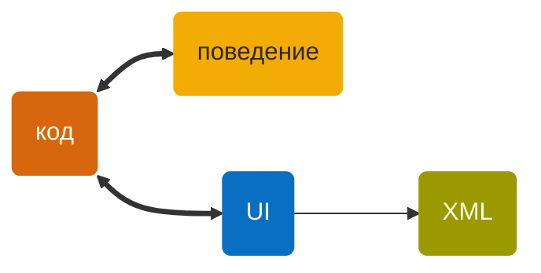
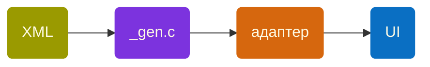

Youtube-запись от `2026-08-14`: https://youtu.be/v3ToZhRdAHg

# Дизайн круглых интерфейсов сразу в коде

> [!WARNING]
> Обычно нет смысла делать продукт ради интерфейса

- Чаще всего интерфейс — вспомогательная и даже незаметная функция.
- Но круглый циферблат — уж слишком экзотичная штука.
- **Хочется** придумать продукт ради такого интерфейса.

### С вами говорит внутренний заказчик

> Пусть приложение показывает часы.
> *Просто часы.*
> **А, ещё!**
> Пусть показывает, в каком окне сколько времени я сегодня провела.
> ~~А, ещё!~~ **Хватит для начала.**

### Код напишем как попало
`Raycast` — собирает логи активных окон — ==TypeScript==
`Самописный сервер` — агрегирует и транслирует эти логи в JSON-формате — ==Python==
`M5Dial` — показывает дашборд — ==C==

> [!NOTE]
> Тут уже не до чистоты кода, лишь бы шевелилось.

### А вот дизайн будем прорабатывать

- [LVGL](https://lvgl.io) — библиотека для создания UI на разном железе.
- [LVGL Pro](https://lvgl.io/pro) — IDE для работы с этой библиотекой.

> [!TIP]
> Главное: LVGL Pro сразу показывает картинки 

**Возможно**, это аргумент для изучения XML-нотации для описания такого дизайна.

#### Засосём дизайн в LVGL Pro

#### Сгенерим UI-код из XML

- И вот у нас уже есть обновлённая версия UI-части **кода**.

#### Хотим [Figma](https://www.figma.com/), не хотим тратить [$20 000](https://lvgl.io/pro/pricing)

> [!NOTE]
> Хорошая задача на вечерок. Или нет.
