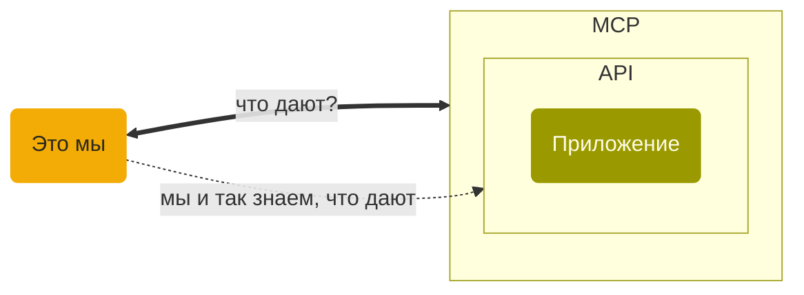

Youtube-запись от `2026-08-07`: https://youtu.be/hj6hgjaLkJc

# MCP без LLM через CLI на примере ESP-IDF

## В ESP-IDF подвезли новости

`eim list-features` — показывает установленные пакеты
```text
core: Core packages necessary for ESP-IDF [installed]
test-specific: Packages for specific test scripts (optional) [installed]
ci: Packages for ESP-IDF CI scripts (optional) [installed]
docs: Packages for building ESP-IDF documentation (optional) [installed]
ide: Packages for IDE support in ESP-IDF (optional) [installed]
mcp: Packages for MCP (Model Context Protocol) server functionality (optional) [installed]
```

> [!CAUTION]
> Ой, что это? \
> mcp: Packages for MCP (Model Context Protocol) server functionality (optional)

Давайте воспользуемся этим непонятно чем, а то что же.

> [!NOTE]
> MCP — это прайс-лист API

- «В моём API есть такие-то команды» — и это всё.
- Афиша, прайс-лист, каталог товаров и услуг.
- MCP прост как пробка, в нём нет никакой магии *вообще*.




- Глобальные [MCP-сервера](https://mcp.espressif.com) — документация, каталог компонентов и другое.

- Локальный — это не обычный MCP-сервер, а STDIO.
- Сидит и слушает вход, а результат отдаёт на выход.

## Начнём с LLM-среды разработки

Для подключения к LLM-среде (например, `codex`) потребуется ssh:

```bash
codex mcp add esp-idf -- \
    ssh op@192.168.1.119 \
    'cd /home/op/dev/stream/done/2026-08-07/m5dial && exec eim run "idf.py mcp-server"'
```

После этого можно посмотреть уже в codex: `/mcp verbose`

Получим примерно (!) такое:
```
  • esp-idf
    • Auth: Unsupported
    • Tools: build_project, clean_project, flash_project, set_target
    • Resources: get_project_config (project://config), get_project_status (project://status), get_connected_devices (project://devices)
    • Resource templates: (none)
```

Ну и команды промптами. Что-то вроде такого:
```
Прочитай MCP resource project://status с сервера esp-idf и покажи его содержимое.
```


> [!WARNING]
> Всё это невероятно глупо.\
> Машина всё равно переводит наши команды в код.\
> **Мы что, сами не справимся, что ли?!**

## Отводим пушку от воробьёв

- На локальной машине работает MCP — «универсальный API» для LLM-клиентов.
- Но это не значит, что MCP ждёт в гости именно LLM-клиента.
- Сходим так.

### Научимся запускать MCP-сервер так, чтобы stdin и stdout постоянно были открыты

##### Соберём скрипт запуска MCP-сервера
```bash
#!/bin/sh
exec eim run "idf.py mcp-server"
```

- Не забудем выставить ему права на запуск: `chmod +x [название файла скрипта]`
- Без скрипта намучаемся с кавычками.

##### Запустим через `socat`
```bash
PYTHONWARNINGS='ignore:::pydantic_settings.sources.utils' \
socat STDIO EXEC:/home/op/dev/stream/done/2026-08-07/mcp/mcp.sh
```
- Обратите внимание на полный путь.
- А на `PYTHONWARNINGS` внимания не обращайте :)

### Поотправляем разное по требованиям MCP-протокола [версии 2025-06-18](https://modelcontextprotocol.io/specification/2025-06-18/basic/lifecycle)

#### Инициализация
```json
{"jsonrpc":"2.0","id":1,"method":"initialize","params":{"protocolVersion":"2025-06-18","capabilities":{},"clientInfo":{"name":"socat-connection","version":"1.0"}}}
```

После ответа — подтверждаем, что всё хорошо:
```json
{"jsonrpc":"2.0","method":"notifications/initialized"}
```

Всё, можно отправлять команды.

#### Действия

Стандартное (!) действие «[Покажи инструменты](https://modelcontextprotocol.io/specification/2025-06-18/server/tools)»:
```json
{"jsonrpc":"2.0","id":2,"method":"tools/list","params":{}}
```

Покажет чёртову уйму. Отформатируем так:
```bash
printf '%s\n' '[сюда копипаст JSON]' | jq '.'
```

Теперь посмотрим на ресурсы — то есть на то, какую информацию можно запросить:
```json
{"jsonrpc":"2.0","id":3,"method":"resources/list","params":{}}
```

Ресурсы не особо страшно запрашивать. Сделаем это.

Стандартным (!) методом чтения запросим индивидуальный для ESP-IDF ресурс `project://devices`:
```json
{"jsonrpc":"2.0","id":4,"method":"resources/read","params":{"uri":"project://devices"}}
```

Теперь статус проекта:
```json
{"jsonrpc":"2.0","id":5,"method":"resources/read","params":{"uri":"project://status"}}
```

Что же это у нас `target` пустой. Рискнём установить:
```json
{"jsonrpc":"2.0","id":6,"method":"tools/call","params":{"name":"set_target","arguments":{"target":"esp32"}}}
```

Ещё раз запрашиваем статус (не забываем менять `id` запроса!) — видим результат.

А теперь конфигурация проекта:
```json
{"jsonrpc":"2.0","id":9,"method":"resources/read","params":{"uri":"project://config"}}
```
Приличненько так получаем.
Жаль, что менять её через MCP нельзя. Пока что.


#### Выключение
Достаточно `Ctrl + D`.

Но если послать старую команду, то будет интересно. Попробуем.
```json
{"jsonrpc":"2.0","id":99,"method":"shutdown"}
```

Ух ты. Копайся не хочу.

### И осталась только удалёнка

Но тут `ssh` вполне работает вместо `socat`, не нужен даже скрипт.

```
ssh op@192.168.1.119 'cd /home/op/dev/stream/done/2026-08-07/mcp && eim run "idf.py mcp-server"'
```
