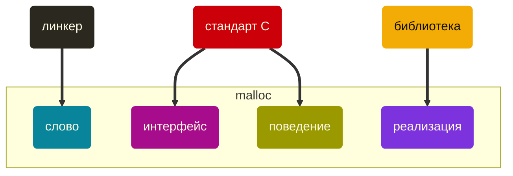
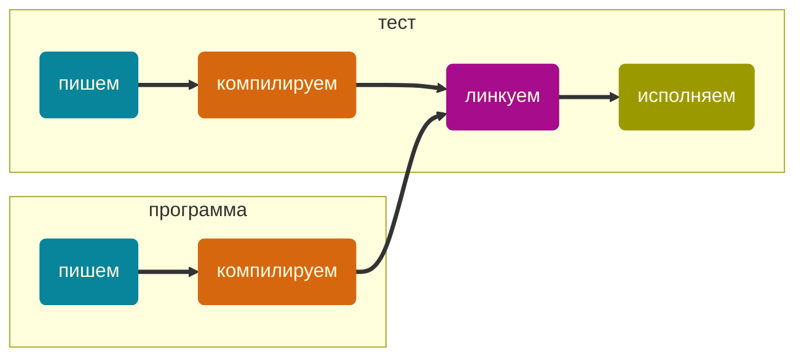
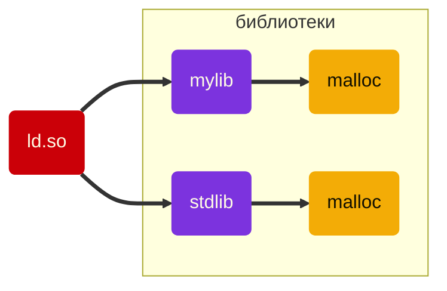

Youtube-запись от `2026-10-02`: https://youtu.be/qr7sawRZ-uU
# Аккуратно ломаем malloc()

Мы по уши в [Behavior Driven Development](https://github.com/olgapavlova/stream/tree/main/done/unit_testing_base).
Требования → unit-тесты → код.
И вот нам понадобилась динамическая память…
Придётся написать **тест** на выделение памяти.
И **на ошибку выделения памяти** — тоже.

> [!caution]
> Как?!

Есть миллион готовых решений и даже библиотек.
Но нам не хочется **сделать**.
Нам хочется ~~задолбаться~~ разобраться.

> [!TIP]
> Хотим контролировать апокалипсис
> - Обычно стараемся избежать проблем с выделением памяти
> - А тут — наоборот, пытаемся вызвать эту проблему

Ясно, что мы хотим сделать что-то, что не лежит на поверхности.
А значит, нужно заглянуть под капот.

> [!note]
> Мы не будем колдовать с исходным кодом
> Слишком легко самообмануться — 
> и протестировать **обёртку** `malloc()` вместо него самого.
> Поэтому — что есть, то есть.
> *Странно, ведь мы же код ещё не написали…*

#### Смоделируем ситуацию — напишем код
Дальше будем потихоньку обкладывать его подушками.
```c
#include <stdio.h>
#include <stdlib.h>

void * i_need_memory(size_t size) { return malloc(size); }

int main(void) {
  void * p = i_need_memory(30);
  printf("\t%s\n", (p == NULL) ? "Подмена!" : "Обычное выделение памяти");
  free(p);
  return 0;
}
```
 - Сразу уберём `malloc()` в функцию — нам нужен объект тестирования.
 - А может, функцию — сразу в библиотеку? Тоже вариант. **Даже лучше.**
## А что вообще такое `malloc` ?

Тут как посмотреть.


> [!warning]
> И они не интересуются друг другом! Это наш шанс.

#### Посмотрим, во что превращается код после компиляции
Без линковки, только `gcc -c once.c -o once.o`
```shell
nm once.o
                 U free
0000000000000000 T i_need_memory
000000000000001c T main
                 U malloc
                 U printf
```

Что здесь любопытно?
1. У тех **символов**, что с `U`, нет адресов — никто не знает, где лежит их реализация. Заменим?
2. Возможно, **реализацию** можно не менять, а тонко настроить? Ну вдруг.
3. Кажется, сами **символы** тоже ещё не поздно поменять на *другие* — никто не заметит.

## Как, что и где мы можем подменить?
### `2` Настройка реализации: делать это, конечно, никто не собирался
В _некоторых_ реализациях архитектура такая: есть некоторый уже выделенный большой кусок памяти.
И `malloc()`, и другие *аллокаторы* выгрызают из него свободные кусочки.

То есть `malloc()` как бы берёт память со склада. `free()` возвращает.
Доступ на склад прямой: сам разбирайся, сам и запрашивай пополнение у внешней ОС.

Очень развесистая реализация. Разная в разных библиотеках.
glibc • musl • BSD • macOS • newlib • picolibc • …

И мы можем подменить **источник памяти**.
Сделать так, чтобы памяти было **явно недостаточно**.

Это для микроконтроллеров хорошо. Там всё попроще.
Не для обычных прикладных программ на десктопах.
### `3` Подмена символов: проще, чем кажется • Link-time wrapping
Линковкой занимается утилита `ld`.
Посмотрим в её [инструкцию](https://sourceware.org/binutils/docs-2.43/ld.pdf). Сразу на страницу `43`, чего откладывать.

`ld --wrap=malloc`

А ведь мы уже своими глазами видели, что в `.o`-файле после компиляции _не определён_ символ `malloc`!

Осталось определить его в своей собственной библиотеке.
Давайте действовать по инструкции, это всегда очень полезно.

**Как подлинковать компилятором** `gcc` без вызова `ld`?

Для этого используем ключ `-W`: `-Wl,--wrap=malloc`

### `1`Замена реализации: наконец-то повеселимся!

Библиотека `glibc` [официально поддерживает](https://snapshots.sourceware.org/glibc/trunk/latest/manual/html_node/Replacing-malloc.html) замену своего allocator'а другим.

Осталось договориться с компилятором.
В широком смысле слова «компилятор» — вся цепочка инструментов, превращающая буквы в исполняемую программу.



> Тут нам пригодятся те самые «странные знания», которые вызывают недоумение: зачем мне это всё время повторяют? Спецификация — зачем? Нюансы линковки — зачем?

 - На этапе написания кода всё тривиально, но крайне коварно (см. врезку выше). Не будем сегодня.
 - На этапе компиляции к нашим услугам макросы и условная компиляция — всё просто. Тоже не будем.


### Подмена реализации при статической компиляции • Link-time substitution
Статическая реализация подтащит в себя всё.
Причём в порядке появления этого «всего» в списке.
Значит, нам надо выдать компилятору свою реализацию раньше, чем системную.

Подсовываем реализацию на этапе линковки явным образом:
```
gcc -static main.o mymalloc.o -o main
```

Флаг `-static` достанет все реализации сразу.
Если его не ставить — ну, библиотека-то динамическая, так что подключение реализации откладывается на этап исполнения.

Тут видно, почему имеет значение порядок объектов и библиотек. Потому что как нашли, так и использовали. Первое, что нашли.

### Подмена реализации по ходу исполнения • Dynamic symbol interposition


Тут беда с возможной рекурсией.
Сложно! Нужно разбираться досконально.

Задача линкера — подцепить к символу реализацию.
Что значит «подцепить»? Указать адрес. Найти его сначала, а потом уж указать.

Где искать-то будет? И когда?

В `.a`-файле лежит по факту архив объектов, которые можно линковать.
Линкер их найдёт. При статической линковке — сразу и включит в исполняемый файл.

**А при динамической что будет?**
Сошлётся на места в динамической библиотеке, но в код не добавит.

Посмотрим:
```
ldd ./twice.run
```

Кто же тогда «подсосёт» код? И когда?

Когда: в момент выполнения.
Кто: операционная система и динамический загрузчик (`ld.so`). Их работа.

```bash
man ld.so
```
- Инструкция есть оффлайн на вашем компьютере, есть [в сети](https://man7.org/linux/man-pages/man8/ld.so.8.html) и [в книжке](https://olgpv.me/to/kerrisk)


И вот динамическому-то загрузчику и можно отдать команду «Сначала посмотри в другое место»!
Это и есть `LD_PRELOAD`.

То, что мы таким образом подключаем, надо компилировать как shared library, да ещё и в режиме Position Independend Code:
```bash
gcc -shared -fPIC dsi.c -o libdsi.so
```

Узнаем что-нибудь про этот файл:
```shell
file libdsi.so
```

Найдём наш malloc — это же экспортируемый символ:
```bash
nm -D libdsi.so | grep malloc
```
- Ключ `-D` покажет только динамические символы.

Дальше хорошо бы исполнить.

`LD_PRELOAD` — прямо в man так и написано: This feature can be used to selectively override functions in other shared objects. При запуске указываем эту переменную окружения, а потом её уже подхватывает динамический загрузчик. Проблема очевидна: все дочерние процессы этого запуска будут наследовать эту переменную. И, значит, переопределяют реализацию `malloc()`.

`--preload` — а вот это уже флаг динамического загрузчика при его вызове напрямую (то есть не через запуск программы). И так можно ограничить переопределение `malloc()` только родительским процессом, но не дочерними.

Ещё можно задать на системном уровне для всех процессов через файл `/etc/ld.so.preload` — но ваш компьютер сильно удивится.

##### Повышаем уровень управляемости

Предыдущий вариант: если мы динамически подключаем другую реализацию `malloc()`, то делаем это для всех вызовов этого `malloc()`.
А нам хочется, чтобы иногда срабатывало, а иногда нет.

То есть иногда «возьми **первую** реализацию», а иногда — «возьми **вторую** реализацию».

У нас есть две реализации: наша подставная — и честная из стандартной библиотеки.
Про обе реализации динамический линкер знает.



Что значит «знает»? Знает их адреса!

По адресам-то он их и вызывает.

То есть нам всего-то и нужно, чтобы иногда требовать вызвать один адрес, а иногда другой.

Вот так можно найти адрес реализации malloc():
```
dlsym(handle, "malloc");
```
 - `dlsym` — dynamic library symbol — символ в динамической библиотеке
 - А что такое `handle`? Инструкция, где искать.
- `RTLD_NEXT` — «ищи в объекте, следующем за тем, из которого тебя вызвали»

**Как динамически подключать библиотеку из того же каталога?**
- `-Wl,-rpath,'$ORIGIN'` на этапе линковки
- `LD_LIBRARY_PATH=.` на этапе запуска
