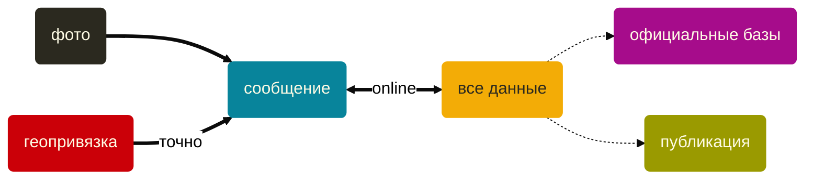
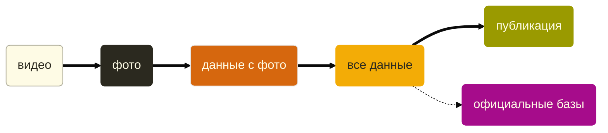

Youtube-запись от `2026-08-21`: https://youtu.be/C1g3hA5aw0M

# Программирование на кладбище

[Книга памяти блокадного Ленинграда](https://blockade.spb.ru) • [Возвращённые имена](https://visz.nlr.ru)

##### Было


##### Как может стать



> [!WARNING]
> Это только один из вариантов.\
> И он — требует проверки.\
> И другие — вполне допустимы.


##### Сделаем и посмотрим
- [k] **Тестовый ручной прогон**
	- [x] Скачать видео из телефона
	- [x] Разложить видео на фотокадры
	- [x] Развернуть кадры как нужно
	- [x] Убрать лишние кадры
	- [/] Собрать Obsidian-картотеку кадров
	- [ ] Сделать summary по кадрам
- [>] **Автоматизация**

##### Шпаргалка по тестовому прогону

###### Режем видео на фотокадры

```bash
mkdir -p src

ffmpeg -copyts \
  -i "src.mov" \
  -map 0:v:0 \
  -vf "select='isnan(prev_selected_t)+gte(t-prev_selected_t,1)',hflip,vflip" \
  -fps_mode passthrough \
  -enc_time_base demux \
  -q:v 2 \
  -f image2 \
  -frame_pts 1 \
  "src/%07d.jpg"
```

> [!CAUTION]
> Ничего себе команда.\
> Больше похоже на программу.\
> Она и есть. Особенно в части `select`.

###### Собираем карточку
`link(name)` — ссылка на страницу по имени\
`link(name).param` — параметр со страницы, найденной по имени\
`embed(link(name))` — картинка по имени\
`elink(url)` — внешняя ссылка\
`choice(bool, true, false)` — отображение бинарного поля

##### Технологии

###### Высокий уровень
- **обработка медиа** — для сбора и обработки данных
- **основы баз данных** — для структурирования накопленной информации
- **объектная модель** — для человекочитаемого представления информации
- **скрипты** — для автоматизации выявленных процессов
- **веб-технологии** — для публикации результатов
- **github и прочее инфраструктурное** — для совместной работы (если нужна)

###### Конкретика
- **[ffmpeg](https://ffmpeg.org)** — для обработки медиаданных
- **CLI** — для быстрой и гибкой автоматизации этой обработки
- **возможности оболочки ОС** — для ускорения ручной части обработки
- **[bash](https://www.gnu.org/software/bash/), [Python](https://www.python.org) и т.п.** — для скриптов
- **[Obsidian](https://obsidian.md)** (или любая другая подобная платформа) — как интерфейс к слабо структурированной информации
	- **[YAML](https://yaml.org/spec/1.2.2/) и [Dataview](https://blacksmithgu.github.io/obsidian-dataview/)** — жёстко структурированная часть
	- **[Markdown](https://www.markdownguide.org)** — слабо структурированная часть

###### Клей
- **управление требованиями** — для достижения реально полезного результата
- **основы управления проектом** — для минимизации усилий на пути получения этого результата
- **UX-практики** — для жизнеспособности результата
- **эрудиция в юридических вопросах** — чтобы не выйти ненароком из правового поля
- **PR и прочая журналистика** — для объяснений сути происходящего внешнему миру (не IT)
- **техническое писательство** — для вовлечения внешнего мира в использование системы

> [!IMPORTANT]
> Здорово, столько мест для накосячить!


##### А чего же тут нет?
- **GUI** — интерфейсы понадобятся позже, если система полетит
- **LLM** — мы же не инвестиции ищем
- **Автоматического распознавания надписей** — пока достаточно ручного
- **Картирования участка** — слишком сложно и не факт что востребовано
- **Встроенного редактора изображений** — зачем делать то, что уже сделано 100500 раз?
- **Дронов и автоматической съёмки** — вот не хватало для полного счастья, да
- **Бизнеса и денег** — это совсем другая игра

